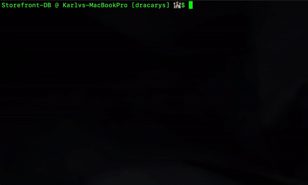

<h1>#Tenochtitlán-Market</h1>

<h2>Project Instructions</h2>

This is an Amazon-like storefront with the MySQL skills. The app will take in orders from customers and deplete stock from the store's inventory.

This project requires MySQL and Inquirer npm packages

 

<h3>How to run the app:</h3>

The code syntax will look like this: <code>node shoppingCustomer.js</code>

